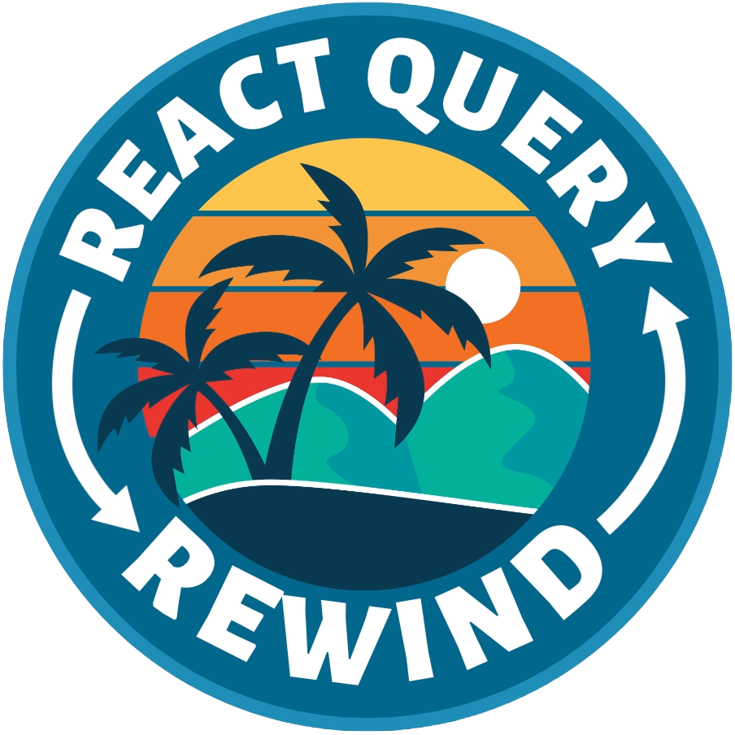
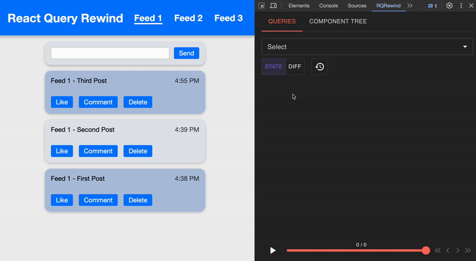
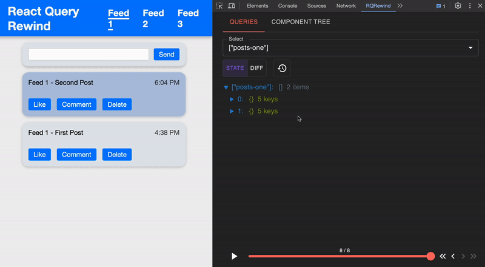
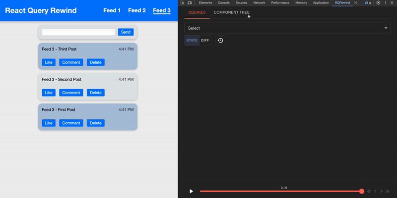

<a name="readme-top"></a>

<p align="center">
  
</p>

# Overview

React Query Rewind introduces a powerful DevTool extension designed to work in conjunction with React Query's built-in DevTools in order to optimize time-traveling through state changes in an application. This open-source extension is tailored to enhance the debugging experience for React Query users, allowing them to explore state changes and component relationships with ease.

# Getting Started

## Prerequisites

This is an example of how to list things you need to use the software and how to install them.

- npm
  ```sh
  npm install RQRewind npm package
  ```

## Installation

1. Get a free API Key at [https://example.com](https://example.com)
2. Clone the repo
   ```sh
   git clone https://github.com/github_username/repo_name.git
   ```
3. Install NPM packages
   ```sh
   npm install
   ```
4. Enter your API in `config.js`
   ```js
   const API_KEY = 'ENTER YOUR API';
   ```

# Features

- <b> Query States: </b> Upon opening RQRewind in Chrome Dev Tools, you will see the Queries tab open with a drop down menu listing the query keys of all the incoming queries. Select the queries that you want to monitor, make changes on the web app, and the changes of query states will be logged as reflected by the growing number above the play bar. Use the play bar to navigate to a particular state snapshot that you would like to inspect.
<p align="center"></p> 

- <b>State Diff: </b>Toggle on the Diff button to see state changes between each snapshot highlighted. Turn on the switch on top of the page to show only parts of the state that are changed. 

<p align="center"></p> 

- <b>Live UI Change: </b>As you review the state change history, there is also the option to turn on the time travel mode by clicking on the clock icon button. Under time travel mode, when visiting a logged state snapshot on RQRewindl, the UI of the app will change accordingly. Turn off time travel mode for RQRewind to continue logging future state changes. 

<p align="center"></p> 

- <b>Component Tree: </b> Click on the Component Tree tab and turn on the Start Profiling switch. Click on any component on the app, and view the component tree that is rendered on the dev tools panel.

<p align="center"></p> 

_For more examples, please refer to the [Documentation](https://example.com)_

# Contributing

React Query Rewind values the strength of community involvement. If you're enthusiastic about React Query, time-traveling state, or improving debugging experiences, your contributions are highly appreciated. Whether it's code enhancements, documentation improvements, or innovative feature suggestions, your engagement can play a pivotal role in shaping the future of React Query Rewind. If you have a suggestion that would make this better, please fork the repo and create a pull request. You can also simply open an issue with the tag "enhancement".
Don't forget to give the project a star! Thanks again!

1. Fork the Project
2. Create your Feature Branch (`git checkout -b feature/AmazingFeature`)
3. Commit your Changes (`git commit -m 'Add some AmazingFeature'`)
4. Push to the Branch (`git push origin feature/AmazingFeature`)
5. Open a Pull Request

<p align="right">(<a href="#readme-top">back to top</a>)</p>

# Contact Information

Austin Cavanagh - [@linkedin_handle](https://twitter.com/twitter_handle) - email@email_client.com

Emma Teering - [@linkedin_handle](https://twitter.com/twitter_handle) - email@email_client.com

John Dunn - [@linkedin_handle](https://twitter.com/twitter_handle) - email@email_client.com

Rui Fan - [@linkedin_handle](https://twitter.com/twitter_handle) - email@email_client.com

# Links

[](MEDIUMARTICLELINKHERE)
[](LINKEDINHERE)

Project Link: [React Query Rewind](https://github.com/oslabs-beta/react-query-rewind-chrome)

# Technologies

[](https://www.javascript.com/)
[](https://www.typescriptlang.org/)
[](https://reactjs.org/)
[](https://html.com/html5/)
[](https://webpack.js.org/)
[](https://d3js.org/)
[](https://eslint.org/)
[](https://mui.com/)
[](https://jestjs.io/)
[](https://babeljs.io/)

# License

MIT Link

<!-- TABLE OF CONTENTS -->
<!-- <details>
  <summary>Table of Contents</summary>
  <ol>
    <li>
      <a href="#about-the-project">About The Project</a>
      <ul>
        <li><a href="#built-with">Built With</a></li>
      </ul>
    </li>
    <li>
      <a href="#getting-started">Getting Started</a>
      <ul>
        <li><a href="#prerequisites">Prerequisites</a></li>
        <li><a href="#installation">Installation</a></li>
      </ul>
    </li>
    <li><a href="#usage">Usage</a></li>
    <li><a href="#roadmap">Roadmap</a></li>
    <li><a href="#contributing">Contributing</a></li>
    <li><a href="#license">License</a></li>
    <li><a href="#contact">Contact</a></li>
    <li><a href="#acknowledgments">Acknowledgments</a></li>
  </ol>
</details> -->

<!-- <p align="right">(<a href="#readme-top">back to top</a>)</p> -->

<!-- <a name="website" href="ARE WE GONNA HAVE A WEBSITE">Website</a> -->

<!-- [](https://github.com/oslabs-beta/react-query-rewind-chrome/graphs/contributors)
[](https://github.com/oslabs-beta/react-query-rewind-chrome/forks)
[](https://github.com/oslabs-beta/react-query-rewind-chrome/stargazers)
[](https://github.com/oslabs-beta/react-query-rewind-chrome/issues)
[](https://github.com/oslabs-beta/react-query-rewind-chrome/blob/main/LICENSE) -->
